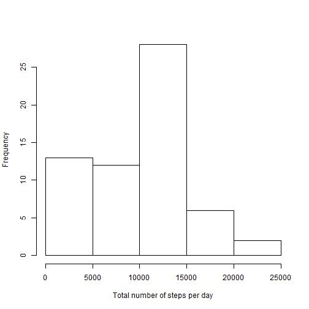
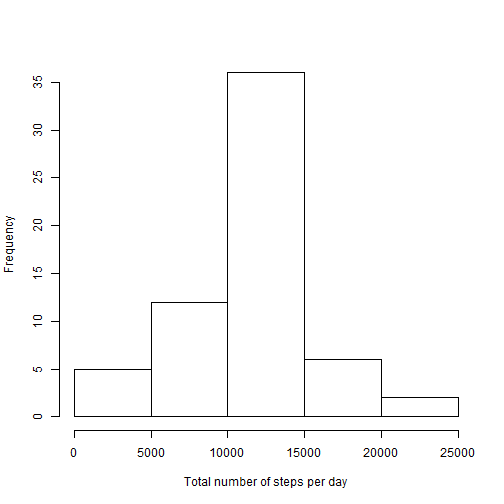

##Reproducible research, assignment 1

###Loading of the data set


```r
setwd("~/GitHub/RepData_PeerAssessment1")
unzip("activity.zip")
data = read.csv("activity.csv")
```

###Calculation of the total numbers of steps taken each day


```r
data.by.day=split(data, data$date)
total <- sapply(data.by.day, FUN=function(t) sum(t$steps,na.rm=TRUE))
hist(total, xlab='Total number of steps per day', main=NULL)
```

 

```r
mean.tot = mean(total)
median.tot = median(total)
```

The mean number of steps taken each day is 9354.2295, the median number is 10395

###Average number of steps taken at a given time interval


```r
data.by.time=split(data, as.factor(data$interval))
average <- sapply(data.by.time, FUN=function(t) mean(t$steps, na.rm=TRUE))
plot(as.integer(names(average)), average, type='l', xlab = "Interval", ylab = "Average number of steps")
```

 

```r
max.i = as.integer(names(which.max(average)))
time.max = paste(as.character(max.i%/%100),as.character(max.i%%100), sep=':')
```

The 5-minute interval with the largest number of steps starts at 8:35

###Replacement of missing values


```r
na.tot = sum(is.na(data$steps))
```

The total number of missing values is 2304

The code below replaces the missing values with the mean number of steps taken at this specific time interval


```r
replace <- (1:length(data$steps))[is.na(data$steps)]
data <- cbind(data, data$steps)
names(data)[4] <- "replaced"
for (int in replace){
    data$replaced[int] <- average[as.character(data$interval[int])]
}
data.by.day=split(data, data$date)
total <- sapply(data.by.day, FUN=function(t) sum(t$replaced))
hist(total, xlab='Total number of steps per day', main=NULL)
```

 

```r
mean.tot2 = as.integer(mean(total))
median.tot2 = as.integer(median(total))
```

After replacing the missing values, the mean number of steps taken each day is 10766, the median number is 10766

###Comparison of activity on weekends and weekdays

This was done with original instead of replaced values

```r
#Splitting data between weekends and weekdays
days <- weekdays(as.POSIXct(as.character(data$date), format='%Y-%m-%d'))
weekend <- days == "Saturday" | days == "Sunday"
data <- cbind(data, as.factor(weekend))
names(data)[5] <- "weekend"
data.by.we=split(data, data$weekend)
names(data.by.we) = c("Weekday", "Weekend")

#Calculation of averages
average.weekday <- sapply(split(data.by.we$"Weekday", as.factor(data.by.we$"Weekday"$interval)), 
                          FUN=function(t) mean(t$steps, na.rm=TRUE))
average.weekend <- sapply(split(data.by.we$"Weekend", as.factor(data.by.we$"Weekend"$interval)), 
                          FUN=function(t) mean(t$steps, na.rm=TRUE))

#Integration in a single data frame and plotting
averages <- as.data.frame(rbind(cbind(names(average.weekday), average.weekday, "Weekday"),
                                cbind(names(average.weekend), average.weekend, "Weekend")))
names(averages) <- c("Interval", "Average", "Day")
averages$Interval <- as.integer(as.character(averages$Interval))
averages$Average <- as.numeric(as.character(averages$Average))
library(lattice)
xyplot(Average ~ Interval | Day, data = averages, type='l', layout=c(1,2), ylab='Number of steps')
```

 

